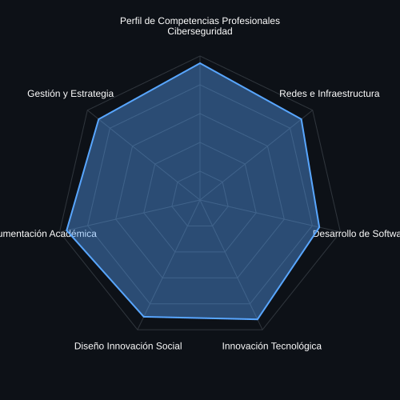

## Hi There! 👨‍💻  
I'm **Ricardo Rojas Cruz (kirito)**, **Ingeniero de Sistemas**,  
**Especialista en Ciberseguridad (CISO)**,  
**MAGIET – Magíster en Gestión de la Innovación y el Emprendimiento Tecnológico**,  
**MADIS – Maestría en Diseño para la Innovación Social**.

- Profesional orientado a **seguridad, innovación y arquitectura tecnológica**
- Autor técnico y productor de documentación académica
- Enfoque en **tecnología con impacto social, ético y sostenible**
- Fundador / responsable técnico de **[macsoftins.com](https://macsoftins.com)**

---

## 📊 Professional Skill Set

## 📚 Repositorios Públicos Destacados

| Repositorio | Enlace | Descripción | Enfoque |
|------------|-------|-------------|---------|
| Sistema de Auditoría USB | https://github.com/kiritodeveloper | Control, detección y verificación de dispositivos USB en Windows/Linux | 🔐 Ciberseguridad |
| Backend Laravel – Monitoreo | https://github.com/kiritodeveloper | Backend para recepción de logs, capturas y eventos de sistemas cliente | 🧠 Backend |
| Automatización con Python | https://github.com/kiritodeveloper | Scripts de OCR, monitoreo de carpetas y automatización de procesos | ⚙️ Automatización |
| Infraestructura Virtualizada | https://github.com/kiritodeveloper | Implementación con Proxmox / ESXi y seguridad perimetral | 🏗️ Infraestructura |
| Auditoría de Credenciales | https://github.com/kiritodeveloper | Análisis educativo de hashes y recuperación controlada | 🧪 Forense |

> 📌 Todos los proyectos tienen **fines académicos, educativos y profesionales**.

---

## 👔 Experiencia Profesional

| Rol | Área | Enfoque |
|----|-----|--------|
| Ingeniero de Sistemas | TI & Redes | Infraestructura, virtualización, soporte avanzado |
| Especialista en Ciberseguridad | Seguridad | Auditoría, hardening, control de accesos |
| Consultor Técnico | Innovación | Arquitectura de soluciones |
| Autor Técnico | Academia | Documentación, libros y memorias técnicas |
| Investigador Aplicado | Innovación Social | Tecnología con impacto social |

---

## 🎓 Formación Académica

- **Ingeniería de Sistemas**
- **Especialización en Ciberseguridad (CISO)**
- **MAGIET** – Magíster en Gestión de la Innovación y el Emprendimiento Tecnológico
- **MADIS** – Maestría en Diseño para la Innovación Social

---

## ✍️ Producción Intelectual

### 📘 Libro
**"El Valor de No Saberlo Todo: Viaje hacia la belleza de lo incompleto"**

- Pensamiento crítico en ingeniería
- Innovación desde la incertidumbre
- Ética tecnológica
- Aprendizaje continuo

> *La tecnología no se domina; se comprende, se documenta y se protege.*

---

## 🛠 Tecnologías y Herramientas

---

## 🌐 Web & Contacto Profesional

🌍 **Website:** https://macsoftins.com  
💻 **GitHub:** https://github.com/kiritodeveloper  

---

## 🧭 Filosofía Profesional

> *La seguridad sin ética es amenaza.*  
> *La innovación sin propósito es ruido.*  
> *La ingeniería documentada es legado.*

---

## 👁️ Visitor Count

---

© **Ricardo Rojas Cruz** — Ingeniería de Sistemas, Innovación y Ciberseguridad
